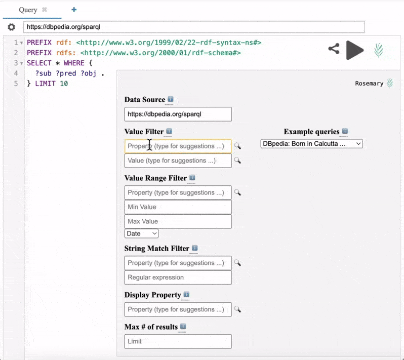

# Rosemary
   

> What if developers and researchers could interact with [Linked Data](https://www.w3.org/DesignIssues/LinkedData) in their applications and analyses as they would any [RESTful API](https://www.geeksforgeeks.org/rest-api-introduction/), no Linked Data or [SPARQL](https://sparql.dev/) knowledge required?

[Rosemary](http://github.com/yasgui-with-rosemary/app) is a plugin for [Yasgui](https://yasgui.triply.cc/) facilitating creation of SPARQL queries without requiring knowledge of SPARQL. It works by providing a front-end consisting of faceted search style filters allowing users to explore and query a public Linked Data store (SPARQL queries are generated in the background from user inputs to accomplish the exploration).

 

 

**Recipe:** use [rosemary](http://github.com/yasgui-with-rosemary/app) to construct queries for retrieving relevant data from public Linked Data stores, publish the queries on [Github](http://github.com) using [grlc publisher](https://github.com/CLARIAH/yasgui-grlc-publisher) and convert them to [RESTful APIs](https://www.geeksforgeeks.org/rest-api-introduction/) with [grlc](http://grlc.io).

### Useful links
---
[What is Linked Data](https://rubenverborgh.github.io/WebFundamentals/semantic-web/)?

[What is SPARQL](https://www.w3.org/TR/sparql11-query/)?

[Yasgui](https://yasgui.triply.cc/) SPARQL editor ([Triply](https://triply.cc/en-US)):
1. [Use it online](https://yasgui.triply.cc/)
2. [Documentation](https://triply.cc/docs/yasgui/)

[Rosemary](http://github.com/yasgui-with-rosemary/app):
1. [Use it online](http://yasgui-with-rosemary.github.io/app)
2. [Documentation](http://yasgui-with-rosemary.github.io/docs)

### Deploy locally (requires [Docker](https://www.docker.com/))*
---
    docker compose up

\* rosemary runs in the browser so you can also run it locally without Docker by opening [index.html](https://github.com/yasgui-with-rosemary/app/blob/main/index.html) in your browser ([Chrome](https://www.google.com/chrome/) **recommended**)

### Testing (requires [Cypress](https://www.npmjs.com/package/cypress))
---
Rosemary makes use of End-to-End testing implemented in [Cypress](https://www.npmjs.com/package/cypress). Ensure you have it installed:

    npm install cypress --save-dev

Since Cypress accesses applications over HTTP, you need to install and run a local HTTP server before running the tests. First install such a server, e.g. [http-server](https://www.npmjs.com/package/http-server):

    npm install -g http-server

Then, run it:

    http-server -p 8080

In another terminal tab or window, you can run the Rosemary Cypress tests with the command:

    npx cypress run --spec "cypress/e2e/autocomplete.cy.js"

### Scope
---
Rosemary is a proof of concept. It does not support the full expressivity of SPARQL (only a restricted subset of [SELECT](https://www.w3.org/TR/sparql11-query/#select) queries) and that is not the intention. It is a tool which can be useful to developers, researchers and students **unfamiliar with Linked Data technologies** for:

1. discovering and exploring what data is in a **public** Linked Data store,
2. learning fundamentals of SPARQL syntax,
3. constructing custom Linked Data queries to retrieve data for:
   1. software applications
   2. data analyses
   3. research projects

**Rosemary assumes that:**

- the names of [resources](https://www.w3.org/TR/rdf12-schema/#ch_classes) (properties, literals, classes etc.) in the Linked Data stores you are querying have a string label indicating their human-readable name **and**...
- ...this label is indicated by an [rdfs:label](https://www.w3.org/TR/rdf12-schema/#ch_label) property **and**...
- ...there is an English or `en` language tag for this label

If you are unsure what these assumptions mean or whether the particular store you are querying meets these criteria, contact the purveyors of that store or ask a colleague familiar with Linked Data technologies to verify this for you.

Rosemary will work better on stores which assign a **unique** human-readable label for each resource. If a particular store does not adhere to this practice, it means there are distinct resources in the store which share the same human-readable name. Duplicate names will show up in the autocompletion results for the dropdowns in rosemary and it will not be possible for the user to distinguish between these resources from the interface.
   
### License
Copyright (2025) [Kody Moodley, The Netherlands eScience Center](https://www.esciencecenter.nl/team/dr-kody-moodley/)

This project is licensed under the [MIT License](LICENSE).

### Credits
---
Thank you to [Richard Zijdeman](https://www.clariah.nl/nl/personen/richard-zijdeman) and [Carlos Martinez-Ortiz](https://www.esciencecenter.nl/team/dr-carlos-martinez-ortiz/) for input and feedback on the design of [rosemary](http://github/yasgui-with-rosemary/app), and to [CLARIAH](https://www.clariah.nl/) for funding the development.

